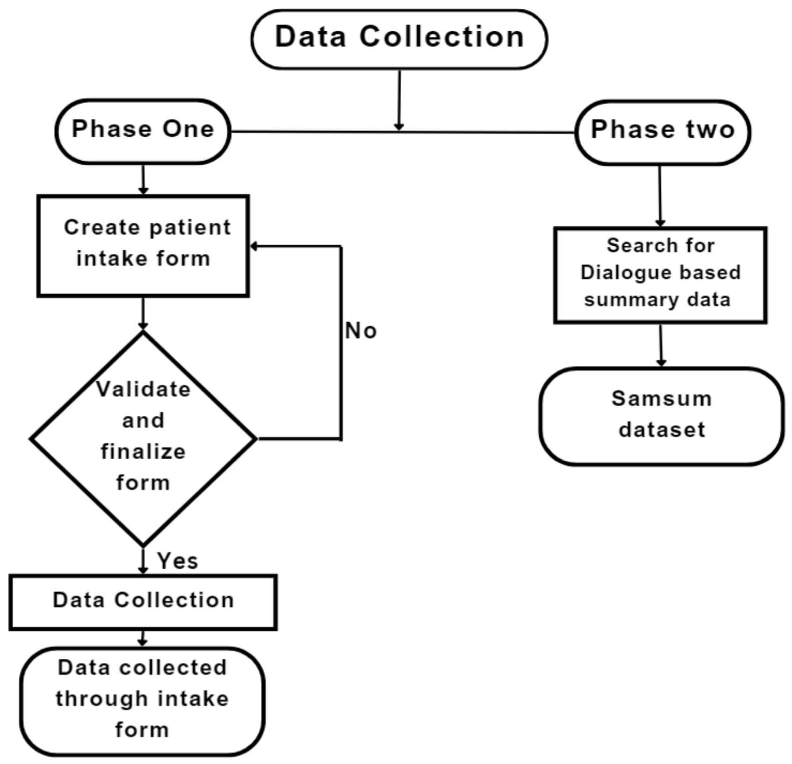
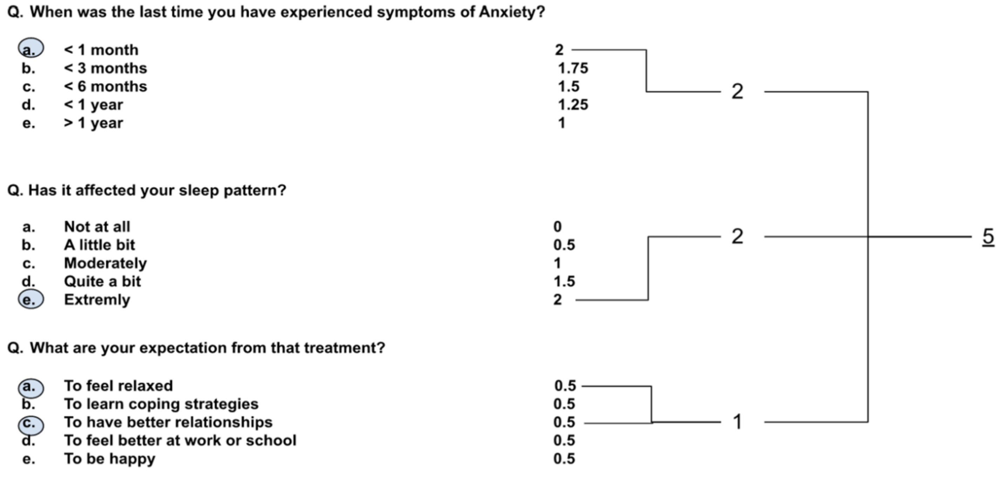

# Capstone Project - Group8
## Calculation of severity for need of assessment and summarization of response in psychometric questionnaire

## Introduction
CogniXR has created a platform to increase the accessibility of mental healthcare solutions so that medical professionals and wellness initiatives may assist more people in achieving more balanced recovery. One of the most pressing challenges of our time is mental health.10% of the worldwide disease burden and 25.1% of non-fatal disease burden are accounted for by mental, neurological, and substance use disorders. Since there are not enough therapists to patients, these easily accessible platforms will be crucial in raising the ratio.

In this project, we have developed a system that will allow us to shorten the time that passes when a patient sees a mental health practitioner for the first time. Any patient who sees a therapist for the first time must fill out an intake form, which asks for information about their personal lives as well as information about their treatment, what kind of treatment they are seeking.

The therapist reviews the information the patient gave in the intake form and attempts to determine the best course of action for that patient after receiving it. With the aid of the knowledge we have learned from Data Analytics for Business starting in the year 2022, we are attempting to make that process easier.

This project may assist a professional in terms of primary analysis and thinking procedure to anticipate the treatment strategies. Help in lowering the cost of treatment by automating the process. So for this we need to create a data driven approach to determine the severity of treatment and a competitive edge to reduce time consumption for filtration of patients

## Data
In the project, two phases were implemented in the data collection method to fulfill the requirement presented by CogniXR. The two phases are shown in the flowchart below: 

## Methodology
The first phase of the project aim was to find severity based on the questions (first dataset) and to provide summarization of the questionnaire data in email. The severity would denote the urgency of the patient where Red (Highly severe), Yellow (Moderate severity), Green (Low severity). Using this severity would help the mental health providers to address the patient according to the urgency of the mental health patient. Along with this severity report would be sent to the provider once the patient  fills out a form.

### Clustering 
The first approach we used was the clustering which would group the data in three sets. We used different clustering methods to group the data i.e DBscan, K-means, K-Mode, Hierarchical-Agglomerative. After trying these clustering methods we went with the K-Means clustering since the silhouette score was high for K-means clustering. Although we were able to form clusters, we still couldn't use this method. The three clusters that were formed showed mixed data, and no conclusions could be made for each of the clusters. 

### Mathmatical Model
To calculate the severity of the patient we developed a scoring logic and assessed the type of therapy the patient will be requiring. Similar technique has been used by [National Center of PTSD, USA](https://www.ptsd.va.gov/professional/assessment/adult-sr/ptsd-checklist.asp)  for calculating the severity of PTSD in PCL-5 questionnaire. [CES-D](https://www.apa.org/pi/about/publications/caregivers/practice-settings/assessment/tools/depression-scale) questionnaire and [Hamilton-D](https://dcf.psychiatry.ufl.edu/files/2011/05/HAMILTON-DEPRESSION.pdf) questionnaire for depression also use similar techniques. [PWSQ](http://fcon_1000.projects.nitrc.org/indi/enhanced/assessments/PSWQ.html#:~:text=The%20scale%20has%20been%20shown,and%2060%2D80%20High%20Worry.)  questionnaire for worry also uses similar scoring for answer choices and gives the severity based on total score.  Each answer choice is given a score. Scores are added together to determine severity. Words like suicidal, suicide, murder, 911, urgent directly flag response as severe. 

Here is the example of the scoring logic. We have used a score of 0-3 range. The positive sentiment is considered as 0 and higher scores indicates severe symptoms. According to the options selected by the patients, the total score will be calculated and the severity is given Red (greater than 20), Yellow (between 10 and 20) and Green (less than 10). 

### Summarization with BART
To provide summarization of any kind of form response, BART model was used. As a questionnaire can be thought as an interrogation, we used SAMSum dataset - which consists of 16,369 conversations that were created by linguists who are fluent in English, they created real-life conversations reflecting their daily life. The style consists of informal, semi-formal, and formal type of conversations that makes it diversified on the basic conversation patterns. The data also consists of Slang words, emoticons, and typos which were annotated with summaries.

We fine-tuned BART model on this dataset so that it could give summaries of dialogue based input text. We appended `Question:` and `Answer:` before every question/answer from the response so our model could treat the questionnaire response as dialogue and give the summary.

### API interface and questionnaire creator
We created API endpoint that would accept list question/answer pairs from the questionnaire response and provide summary using the model. The endpoint would also optionally take in `locale` of the response and translate into english before summarization if need be. 

Using [SurveyJS](https://surveyjs.io/), we interfaced the API with our own questionnaire management platform. We created Flask application where users could design their own questionnaire and send it out to people. The response submitted is fed into model for summarization. The summary output is also translated in French language using google translate API and summary report is generated. This report is mailed to all associated email addresses provided while dsigning the questionnaire.

## Conclusion and Future Work
We have to consider the biases in the project. One of them is that missing out on useful data as we are using summarization method, the model is not sensible enough for the sensitive content. The second one is there is no filtration of the offensive content as there are chances of participants to fill offensive contents which might interfere with the summary. The last one is the chances of creating duplicate sentences to fulfill minimum word criteria for the summary.

Our first approach can provide severity of patients for mental health condition and second approach can summarize questionnaire filled by the patients saving providers' time. In future, methods can be developed to combine both approach which would give summary as well as severity for any psychometric questionnaire. This would require preparation of dataset where severity is manually annotated for a response. A NLP model would then be able to identify key phrases and features determing severity and classify the response accordingly.
